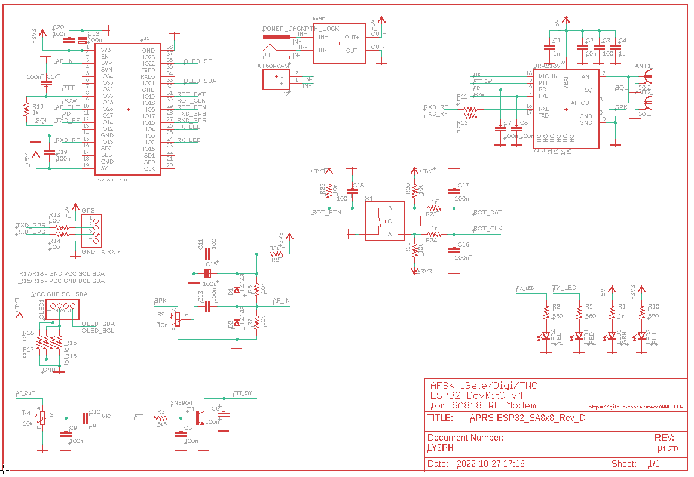
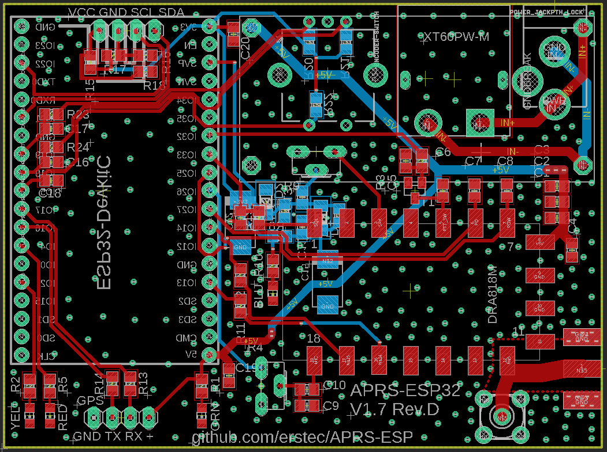

# FW and HW is tested and stable. Rotary encoder/menu not implemented yet, but will be added later.

Feel free to ask [Me](https://github.com/erstec) by creating [Discussion](https://github.com/erstec/APRS-ESP/discussions/new), by e-mail or via Discord.

# APRS-ESP32 Project

APRS-ESP32 is a APRS AFSK1200 Tracker + Digipeater + Internet Gateway + TNC built-in that is implemented for Espressif ESP32 MCU.

APRS-ESP32 is a small interface board with SA8x8 RF Module on it designed to work standalone, without any USB connection.

## Features
### FW
- IGate
- Digipeater
- Position beaconing (periodical)
- SmartBeaconing (IN PROGRESS)
- OLED display operation states and etc.
- All parameters changeable via WEB interface
- Some parameters changeable via OLED / Rotary encoder (NOT IMPLEMENTED)

### HW
- ESP32-DevKitC-v4 (or any pin/size compatible)
- SA818/SA868 RF Modem
- Any NMEA output serial (UART) GNSS Receiver
- SSD1306 0.96" / SH1106 1.3" OLED Screen
- Rotary encoder
- Adjustable Regulated buck converter (LM2596S based)
- PCB (Gerber and Eagle), BOMs in /hardware folder

### Details
* Development based on PlatformIO / Visual Studio Code IDE
* Support Bell202 1200bps AFSK modulation
* Software modem for decoding and encoding
* ---about >800 packets can be decoded against WA8LMF TNC TEST CD Track 1 (MP3) (TESTS NEEDED)
* (REMOVE) ---support TNC2 Raw protocol only
* Using USB serial for host connection and power supply (modem can work in LOW Power mode only! DON'T SET MODEM POWER TO HIGH)
* DC barrel socker for powering board (5.5x2.1mm with pin positive, 7-40V DC)
* XT60 socket for powering from 2S-6S LiPo battery
* Support Wi-Fi connection (TCP and UDP) to APRS-IS
* Support Web Service config and control system
* Display status on the OLED
* Manual Position transmission - short press button

### Schematics

### PCB

### CAD data
 
GERBER data is [here](hardware/GERBER/APRS-ESP32_SA8x8_V1.7_Rev_D_2022-10-27.zip)

PCB Layout is [here](hardware/APRS-ESP32_SA8x8_Rev_D_PCB.pdf)

Schematic PDF is [here](hardware/APRS-ESP32_SA8x8_Rev_D_Schematics.pdf)

### BOM list  

Bill Of Materials (BOM) is [here](hardware/APRS-ESP32_SA8x8_Rev_D_BOM.txt)

## FLASHING FIRMWARE
### First time only. Later update via Web Interface

### Using Pecompiled Binaries
- Connect the USB cable to the ESP32 Module while BOOT button pressed
- [Download](https://github.com/erstec/releases) required firmware file
- [Download](https://www.espressif.com/en/support/download/other-tools) Espressif Flash Download Tool and start it
- Select SPISownload tab
- Open file downloaded in ESP32 DOWNLOAD TOOL
- Set location to 0x10000(0xe000?)
- Press START button ans wait till FINISH appears
- Restart ESP32 Module (replug USB or press Reset button)
- Search WiFi for AP SSID APRS-ESP32, Password: aprs
- Open a browser and go to address http://192.168.4.1
- Make all required configuration

### Building yourself
- Pull and Compile with PlatformIO on the Visual Studio Code
- Adjust settings (if needed) in `main.h` and `pinout.h`
- Select correct Target
- Connect USB cable to the ESP32 module
- Build and Upload using PlatforIO buttons
- Search WiFi for AP SSID APRS-ESP32, Password: aprs
- Open a browser and go to address http://192.168.4.1
- Make all required configuration

## NOTE
* Short Press of BOOT button >100 ms) - TX Position
* Long press of BOOT button (10 sec) - Turn WiFi ON/OFF
* Very Long press of BOOT button (20 sec) - Reset Configuration to Factory Default

## NOTE
(REMOVE)---This project implement by APRS text (TNC2 Raw) only,It not support null string(0x00) in the package.

## USING LILYGO T-TWR V1.4 BOARD
### Introduction
LilyGo T-TWR V1.4 is a compact board with ESP32-S3 MCU, SA868 2W RF Module, OLED display, USB-C connector, 18650 battery holder, and integrated LiPo charger.
This board is suitable for APRS-ESP32 project, but it uses ESP32-S3 MCU, which don't have DAC and I2S ADC functionality, so existing code, written for ESP32 MCU can't be used straight way. This board also have some hardware limitations, that need to be addressed, like abscence of audio routing between SA686 RF modem and ESP32 MCU, as well as audio level and filtering circuits.
I've bought few of these boards and made some modifications to make it work with APRS-ESP32 project.

### READ THIS FIRST
This will require *very good* soldering skills and some hardware modifications.
You will need to deal with 0201 SMD components, have a hot air soldering station, good flux, soldering iron with a very fine tip, and a lot of patience.
Don't try this if you are not sure what you are doing.
You WILL lose your warranty if you do this, don't claim anything from the seller or me if you break your board. YOU DOING THIS ON YOUR OWN RISK! YOU ARE WARNED!
After this mod you will not be able to use integrated USB port for programming. Only charging will be possible.
All programming will be done via side UART connector or via RT/TX pads on the header.

For me it took about 2 hours to make all modifications, but I have all required tools and experience.

### Required Components
- 1x ESP32-WROOM-32E MCU Module
- 1x ESP32-S3 to ESP32-WROOM-32E Adapter Board (link here). Thickness of PCB may vary, but 0.8mm is recommended.
- 1x Audio Adapter Board (link here), order PCB and assemble yourself, BOM (here (link here))
- Few wires, I'm using silicone coated, 1mm diameter, 0.5mm core
- 1x 1kOhm resistor, 0.125W, tru-hole type
- 3 mm heat shrink tube, approx. 20 mm long
- Copper foil tape or captone tape
- Soldering wire, flux, iron, hot air station, tweezers, isopropyl alcohol, soldering wick, double sided tape, etc.

### Soldering / MCU Replacement
- Power off the board, remove battery, unplug USB cable
- Remove Microphone
- Remove Mic pull-ip Resistor R2 (marked)
- Detach and remove (unsolder) Speaker
- Remove Speaker to AMP resistor RF1 (marked)
- Very firmly remove OLED display with plastic frame, it's glued to the board, so you need to apply some force to remove it, but be careful not to damage the ribbon cable.
- Disconnect ribbon cable from the main board and store OLED display with plastic frame in a safe place.
- Take 1kOhm resistor, cut it to required length to be able bridge pad IO11 and SA686 module pad 1 (marked), put heat shrink tube on it, solder it to the pads, use hot air to shrink the tube. This is SQL line, it allow MCU do decoding job more properly. It is highly recommended, otherwise you will have to modify code to disable SQL.
- Apply copper foil tape or captone tape around ESP32-S3 MCU to protect components around from heat.
- Desolder ESP32-S3 MCU from the board. Use hot air station, set temperature to 400C, use mid flow. Be careful not to damage the pads.
- Clean pads from solder using solder wick and isopropyl alcohol or flux cleaner.
- Apply fresh solder to the pads, fresh flux and solder ESP32-S3 to ESP32-WROOM-32E Adapter Board to the pads. Be careful not to short any pads. Use hot air station to solder the module. Make sure adapter board is aligned properly. Make sure all pads are soldered properly. Use some force from top to press adapter board to the main board. Use multimeter to check for shorts between pads.
- Remove copper foil tape or captone tape.
- Clean all around with isopropyl alcohol or flux cleaner.
- Apply fresh flux to the pads of upper adapter side.
- Align ESP32-WROOM-32E MCU to the adapter board, make sure all pads are aligned properly.
- Solder ESP32-WROOM-32E MCU to the adapter board. use soldering iron with fine tip. Make sure all pads are soldered properly.
- Clean all around with isopropyl alcohol or flux cleaner.
- At this moment you can upload firmware to the board and test it. You can use side UART connector or RT/TX pads on the header for programming. Board should start, OLED shoulg show status screen, and you should be able to connect to the board via WiFi. If not - check your soldering. Don't forget to attach antenna or dummy load to the board! Otherwise you will damage RF module!

### Assembling / Audio Adapter Board
- Take prepared and assembled Audio Adapter Board, apply double sided tape to the bottom side of the board, align it and stick to the top of ESP32-WROOM-32E MCU shield.

### Wiring / Audio Adapter Board
- Prepare six wires, approx 10 cm long, strip and tin one side of each wire.
- Solder one side of each wire to the pads of the Audio Adapter Board, as shown on the picture.
- Mesure and cut each wire to required length. Solder other side of each wire to the pads, as shown on the picture. Black - to GND. Red - to 3V3. Yellow and Blue to pads on ESP32 Adapter Board. White - to Mic + pad and Orange to SA868 module pad 3 (marked).

### Programming
- Connect USB-UART adapter to the side UART connector or RT/TX pads on the header. You can power the board from USB-UART adapter or plugging USB-C cable to integrated USB-C connector. DON'T USE BOTH AT THE SAME TIME! DON'T INSTALL BATTERY AT THIS MOMENT!
- Press and hold Boot button together with Reset button.
- Attach USB-UART adapter to your PC. Board should be powered on and Green LED should light up.
- Release Reset button, then release Boot button.
- Upload firmware to the board using your favorite tool or instructions proviided on main readme page. I'm using PlatformIO IDE.
- After firmware is uploaded, shortly press Reset button. Board should start and OLED should show status screen.
- Configure using WiFi AP mode. Don't forget to set your callsign and SSID, frequency, etc.

## Connecting GPS Module
- You can use any GPS module with UART interface. 3.3V powered are preferable. I'm using NEO-6M module.
- Connect GPS module to the board using 3V3, GND, TX (IO18) and RX (IO17) pads.

## USING LILYGO T-TWR PLUS V2.0 BOARD
### Introduction
LilyGo T-TWR V2.0 is a compact board with ESP32-S3 MCU, SA868 2W RF Module, OLED display, USB-C connector, 18650 battery holder, GPS receiver and integrated LiPo charger/PMU.
This board is suitable for APRS-ESP32 project, but it uses ESP32-S3 MCU, which don't have DAC and I2S ADC functionality, so existing code, written for ESP32 MCU can't be used straight way. This board also have some hardware limitations, that need to be addressed.
I've own few of these boards and made some modifications to make it work with APRS-ESP32 project.

### READ THIS FIRST
This will require *very good* soldering skills and some hardware modifications.
You will need to deal with 0201 SMD components, have a hot air soldering station, good flux, soldering iron with a very fine tip, and a lot of patience.
Don't try this if you are not sure what you are doing.
You WILL lose your warranty if you do this, don't claim anything from the seller or me if you break your board. YOU DOING THIS ON YOUR OWN RISK! YOU ARE WARNED!
After this mod you will not be able to use integrated USB port for programming. Only charging will be possible.
All programming will be done via side UART connector or via RT/TX pads on the header.

For me it took about 1 hour to make all modifications, but I have all required tools and experience.

### Required Components
- 1x ESP32-WROOM-32E MCU Module
- 1x ESP32-S3 to ESP32-WROOM-32E Adapter Board (link here). Thickness of PCB may vary, but 0.8mm is recommended.
- 1x Audio Adapter Board (link here), order PCB and assemble yourself, BOM (here (link here))
- 1x 1kOhm resistor, 0.125W, tru-hole type
- 1x 0402 (1005 metric) 33kOhm resistor
- 3 mm heat shrink tube, approx. 20 mm long
- Copper foil tape or captone tape
- Soldering wire, flux, iron, hot air station, tweezers, isopropyl alcohol, soldering wick, double sided tape, etc.

### Soldering / MCU Replacement
- Power off the board, remove battery, unplug USB cable
- Unscrew and very firmly remove OLED display with plastic frame, it's glued to the board, so you need to apply some force to remove it, but be careful not to damage the ribbon cable.
- Disconnect ribbon cable from the main board and store OLED display with plastic frame in a safe place.
- Take 1kOhm resistor, cut it to required length to be able bridge pad IO14 and SA686 module pad 1 (marked), put heat shrink tube on it, solder it to the pads, use hot air to shrink the tube. This is SQL line, it allow MCU do decoding job more properly. It is highly recommended, otherwise you will have to modify code to disable SQL.
- Apply copper foil tape or captone tape around ESP32-S3 MCU to protect components around from heat.
- Desolder ESP32-S3 MCU from the board. Use hot air station, set temperature to 400C, use mid flow. Be careful not to damage the pads.
- Clean pads from solder using solder wick and isopropyl alcohol or flux cleaner.
- Apply fresh solder to the pads, fresh flux and solder ESP32-S3 to ESP32-WROOM-32E Adapter Board to the pads. Be careful not to short any pads. Use hot air station to solder the module. Make sure adapter board is aligned properly. Make sure all pads are soldered properly. Use some force from top to press adapter board to the main board. Use multimeter to check for shorts between pads.
- Remove copper foil tape or captone tape.
- Clean all around with isopropyl alcohol or flux cleaner.
- Apply fresh flux to the pads of upper adapter side.
- Align ESP32-WROOM-32E MCU to the adapter board, make sure all pads are aligned properly.
- Solder ESP32-WROOM-32E MCU to the adapter board. use soldering iron with fine tip. Make sure all pads are soldered properly.
- Clean all around with isopropyl alcohol or flux cleaner.
- At this moment you can upload firmware to the board and test it. You can use side UART connector or RT/TX pads on the header for programming. Board should start, OLED shoulg show status screen, and you should be able to connect to the board via WiFi. If not - check your soldering. Don't forget to attach antenna or dummy load to the board! Otherwise you will damage RF module!

### Modifications / RX Audio Level
- Locate Rxx resistor (marked) and remove it.
- Solder prepared 33kOhm resistor to the pads. This will reduce RX audio level to acceptable level.

### Finish / Assembling
- Connect OLED display ribbon cable to the main board.
- Firmly attach OLED display with plastic frame to the main board.
- Screw OLED display to the main board.

### Programming
- Connect USB-UART adapter to the side UART connector or RT/TX pads on the header. You can power the board from USB-UART adapter or plugging USB-C cable to integrated USB-C connector. DON'T USE BOTH AT THE SAME TIME! DON'T INSTALL BATTERY AT THIS MOMENT!
- Press and hold Boot button together with Reset button.
- Attach USB-UART adapter to your PC. Board should be powered on and Green LED should light up.
- Release Reset button, then release Boot button.
- Upload firmware to the board using your favorite tool or instructions proviided on main readme page. I'm using PlatformIO IDE.
- After firmware is uploaded, shortly press Reset button. Board should start and OLED should show status screen.
- Configure using WiFi AP mode. Don't forget to set your callsign and SSID, frequency, etc.

# COPYRIGHT NOTICE
Firmware part uses ideas and code snippets from:
- https://github.com/nakhonthai/ESP32IGate
- https://github.com/sh123/aprs_tracker

Hardware part uses ideas, libraries and designs from:
- https://github.com/nakhonthai/ESP32IGate / schematics base
- https://github.com/handiko/Dorji-TX-Shield / board base
- some another Eagle libraries from various sources
