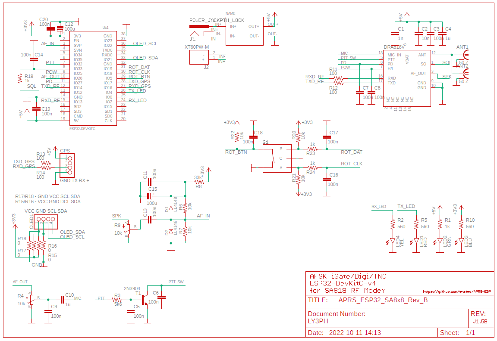
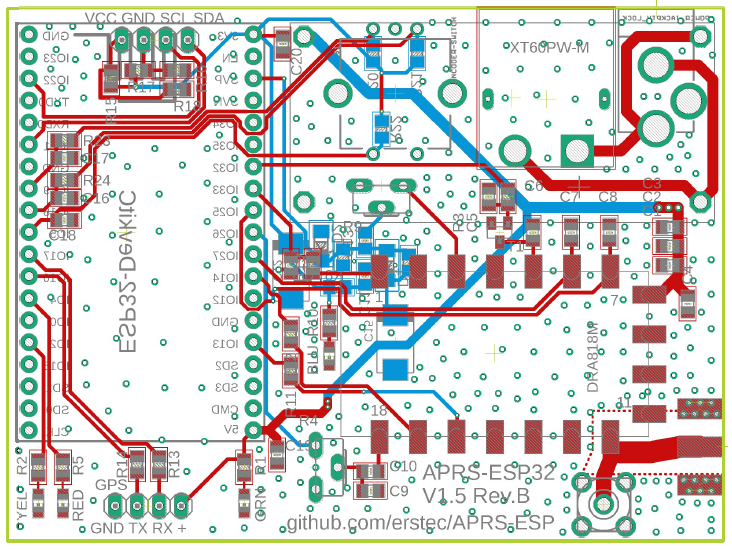

# ATTENTION: FW and HW is tested and stable. Rotary encoder/menu not implemented yet, but will be added later.
Feel free to ask [Me](https://github.com/erstec) by creating [Discussion](https://github.com/erstec/APRS-ESP/discussions/new), by e-mail or via Discord.

# APRS-ESP32 Project

APRS-ESP32 is a APRS AFSK1200 Tracker + Digipeater + Internet Gateway + TNC built-in that is implemented for Espressif ESP32 MCU.

APRS-ESP32 is a small interface board with SA8x8 RF Module on it designed to work standalone, without any USB connection.

## Features
### FW
- IGate
- Digipeater
- Position beaconing (periodical)
- SmartBeaconing (IN PROGRESS)
- OLED display operation states and etc.
- All parameters changeable via WEB interface
- Some parameters changeable via OLED / Rotary encoder (NOT IMPLEMENTED)

### HW
- ESP32-DevKitC-v4 (or any pin/size compatible)
- SA818/SA868 RF Modem
- Any NMEA output serial (UART) GNSS Receiver
- SSD1306 0.96" / SH1106 1.3" OLED Screen
- Rotary encoder
- Adjustable Regulated buck converter (LM2596S based)
- PCB (Gerber and Eagle), BOMs in /hardware folder

### Details
* Development based on PlatformIO / Visual Studio Code IDE
* Support Bell202 1200bps AFSK modulation
* Software modem for decoding and encoding
* ---about >800 packets can be decoded against WA8LMF TNC TEST CD Track 1 (MP3) (TESTS NEEDED)
* (REMOVE) ---support TNC2 Raw protocol only
* Using USB serial for host connection and power supply (modem can work in LOW Power mode only! DON'T SET MODEM POWER TO HIGH)
* DC barrel socker for powering board (5.5x2.1mm with pin positive, 7-40V DC)
* XT60 socket for powering from 2S-6S LiPo battery
* Support Wi-Fi connection (TCP and UDP) to APRS-IS
* Support Web Service config and control system
* Display status on the OLED
* Manual Position transmission - short press button

### Schematics

### PCB

### CAD data
 
GERBER data is [here](hardware/GERBER/APRS-ESP32_SA8x8_V1.5_Rev_B_2022-10-11.zip)

PCB Layout is [here](hardware/APRS-ESP32_SA8x8_Rev_B_PCB.pdf)

Schematic PDF is [here](hardware/APRS-ESP32_SA8x8_Rev_B_Schematics.pdf)

### BOM list  

Bill Of Materials (BOM) is [here](hardware/APRS-ESP32_SA8x8_Rev_B_BOM.txt)

## FLASHING FIRMWARE
### First time only. Later update via Web Interface

### Using Pecompiled Binaries
- Connect the USB cable to the ESP32 Module while BOOT button pressed
- [Download](https://github.com/erstec/releases) required firmware file
- [Download](https://www.espressif.com/en/support/download/other-tools) Espressif Flash Download Tool and start it
- Select SPISownload tab
- Open file downloaded in ESP32 DOWNLOAD TOOL
- Set location to 0x10000(0xe000?)
- Press START button ans wait till FINISH appears
- Restart ESP32 Module (replug USB or press Reset button)
- Search WiFi for AP SSID APRS-ESP32, Password: aprs
- Open a browser and go to address http://192.168.4.1
- Make all required configuration

### Building yourself
- Pull and Compile with PlatformIO on the Visual Studio Code
- Adjust settings (if needed) in `main.h` and `pinout.h`
- Select correct Target
- Connect USB cable to the ESP32 module
- Build and Upload using PlatforIO buttons
- Search WiFi for AP SSID APRS-ESP32, Password: aprs
- Open a browser and go to address http://192.168.4.1
- Make all required configuration

## NOTE
* Short Press of BOOT button ()>100 ms) - TX Position
* Long press of BOOT button (10 sec) - Reset Configuration to Factory Default

## NOTE
(REMOVE)---This project implement by APRS text (TNC2 Raw) only,It not support null string(0x00) in the package.

# COPYRIGHT NOTICE
Firmware part uses ideas and code snippets from:
- https://github.com/nakhonthai/ESP32IGate
- https://github.com/sh123/aprs_tracker

Hardware part uses ideas, libraries and designs from:
- https://github.com/nakhonthai/ESP32IGate / schematics base
- https://github.com/handiko/Dorji-TX-Shield / board base
- some another Eagle libraries from various sources
