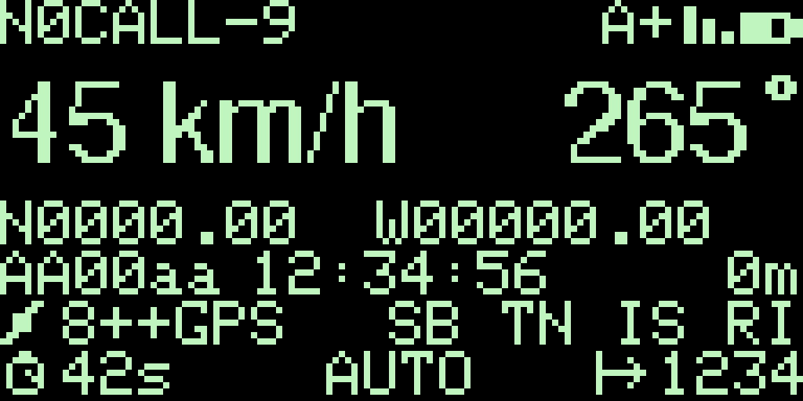

# APRS-ESP32 Project — v2.0

APRS-ESP32 is an APRS AFSK1200 Tracker + Digipeater + Internet Gateway for Espressif ESP32/ESP32-S3 MCUs.

> **v2.0 breaking change:** filesystem migrated from SPIFFS to LittleFS. All web UI assets are stored on LittleFS. A full flash (firmware + filesystem) is required when upgrading from v1.x.

Feel free to ask [Me](https://github.com/erstec) by creating a [Discussion](https://github.com/erstec/APRS-ESP/discussions/new), by e-mail.

---

## Features

### Firmware

- IGate (APRS-IS internet gateway)
- Digipeater
- Tracker with SmartBeaconing
- Fixed position and item beaconing
- APRS message receive: inbox with unread counter, popup notification, and automatic ACK
- Received APRS packet list with raw packet viewer
- OLED display with rotary encoder menu, live GNSS status screen, and graphical APRS symbol picker
- Automatic GNSS configuration on boot: GPS+BeiDou+GLONASS, NMEA output filtered to GGA/GSA/RMC (T-TWR Plus / Quectel L76K)
- Web interface for all configuration
- Interactive map location picker with GPS fix-from-device button; offline tiles bundled for use without internet
- Graphical APRS symbol picker in web UI and OLED menu
- Visual APRS-IS filter builder (range, prefix, buddy, type tokens)
- Battery / PMU status dashboard card (charger state, voltage, %, VBUS, sys voltage, PMU temperature)
- Configuration backup / restore (JSON)
- OTA firmware update via web interface

### Supported Hardware

| Target | Notes |
| ------ | ----- |
| **LilyGO T-TWR Plus (Rev 2.0)** | Fully supported, recommended |
| **LilyGO T-TWR V1** | Supported (UNTESTED) with hardware mods — see [doc/mod-hw-devel.md](doc/mod-hw-devel.md) |
| **ESP32-DevKitC + SA818/SA868** | DIY build — see schematics below |

> **esp32dev-t-twr-mod is removed** — that variant was an intermediate hardware mod that is no longer maintained.

---

## OLED Display

### Main status screen



The display is 128×64 pixels. The speed/heading zone uses a large proportional font; all other zones use the default 6×8 bitmap font. `[sat]` `[clk]` `[->]` represent 8×7 px graphical bitmap icons.

```text
N0CALL-9              A+ [wifi][bat]  <- callsign / APRS-IS / WiFi / battery
                                      | large font zone
  45 km/h                    265°     <- speed (left) · heading (right)
                                      |
N0000.00  W00000.00                   <- coordinates (NMEA)
AA00aa    12:34:56           0m       <- locator / time / altitude
[sat]8++GPS        SB TN IS RI       <- satellites / sync source / flags
[clk]42s   AUTO      [->]1234        <- GPS age / send mode / distance
```

| Zone | Position | Content | Values / meaning |
| ---- | -------- | ------- | ---------------- |
| Callsign | left | **Callsign + SSID** | `{MYCALL}-{SSID}` |
| Callsign | right | **APRS-IS status** | `A+` connected, `A-` disconnected (only when APRS-IS enabled) |
| Callsign | right | **WiFi icon** | Rising signal bars = connected to AP; X + bar = disconnected (only when WiFi enabled) |
| Callsign | right | **Battery icon** | Outline + proportional fill; lightning bolt when charging |
| Speed/Heading | left | **Speed** | Ground speed in km/h (large font) |
| Speed/Heading | right | **Heading** | Course in degrees + ° (large font); `---` when no fix |
| Coordinates | full | **Lat + Lon** | NMEA format `NDDMM.MM WDDDMM.MM`; zeroed when no fix |
| Locator row | left | **QTH locator** | Maidenhead grid square (6-char); `------` when no GPS fix |
| Locator row | center | **Time** | `HH:MM:SS` local time; `NO TIME` if not yet synced |
| Locator row | right | **Altitude** | Metres above sea level; blank when no fix |
| Satellites | left | **[sat icon] Satellite info** | `{count}{fix}{pkt}` — count; `+`/`-` for valid fix; `+`/`-` for GPS packets received |
| Satellites | left | **Time sync source** | `GPS`, `NTP`, `APR` = source; `NO` = not synced |
| Satellites | right | **Beacon mode + flags** | `SB` SmartBeaconing, `T{n}` = fixed interval (min); `TN` RF, `TM` telemetry, `DG` digi, `IS` APRS-IS, `RI` RF→IGate, `IR` IGate→RF |
| Bottom | left | **[clock icon] GPS age** | Seconds since last valid fix; `--s` when no fix |
| Bottom | center | **Send mode** | `AUTO` (GPS→Fixed fallback), `GPS` (GPS-only), `FIX` (fixed position) |
| Bottom | right | **[arrow icon] Distance** | Distance travelled since last beacon; `0` when no fix |

---

## Rotary Encoder Menu

### Short press — enter main menu

Scroll with the encoder knob. Press to select / toggle each item:

| # | Item | Action |
| - | ---- | ------ |
| 0 | Send Beacon | Transmit position now |
| 1 | Beacon Mode | Select: SmartBeaconing (SB) or fixed interval 1/2/5/10/15/20/30/60 min |
| 2 | WiFi | Cycle: OFF → AP → STA → AP+STA |
| 3 | APRS-IS | Toggle ON/OFF |
| 4 | Digi | Toggle digipeater ON/OFF |
| 5 | RF/TNC | Toggle RF modem ON/OFF |
| 6 | RF Power | Toggle Low / High transmit power |
| 7 | Send Mode | Cycle: AUTO (GPS→Fixed fallback) / GPS only / Fixed position |
| 8 | Callsign-SSID | Edit callsign (A-Z, 0-9, min 3 chars, max 6) then SSID (0-15) |
| 9 | Symbol | Graphical APRS symbol picker: scroll through 12 presets (Car, House, Hiker, Bike, …), OLED shows the symbol bitmap + table/char code |
| 10 | Brightness | Set OLED brightness: Min / Low / Medium / High / Max |
| 11 | Auto-Dim | Set auto-dim timeout and level |
| 12 | Locator Popup | Duration of grid locator popup (OFF or 1–10 s) |
| 13 | APRS RX Popup | Duration of received packet popup (OFF or 1–10 s) |
| 14 | RX Packet List | Scrollable list of received APRS packets; press to view full raw packet |
| 15 | MSG Inbox | Received APRS messages; shows unread count |
| 16 | GNSS Status | Live GNSS data screen (see below) |
| 17 | Battery Status | Live battery / PMU status (charger state, voltage, %, VBUS, sys voltage, PMU temp) |
| 18 | About | Firmware version, callsign and IP address |
| 19 | Factory Reset | Erase all settings (YES/NO confirmation) |

Long press from inside the menu → exit without saving.

### GNSS Status screen (item 16)

Live GNSS data, updated every second. Press to return to menu.

```text
   GNSS STATUS
GPS:5  BDS:3  GLO:4
Lat: 5412.34N
Lon: 02512.34E
Alt: 123.4m  3D
Spd: 12.3  Crs: 180
HDOP:1.2 Sat:12 #17
press: back
```

| Row | Content |
| --- | ------- |
| 1 | Satellites **in use** per constellation: GPS / BDS (BeiDou) / GLO (GLONASS) |
| 2 | Latitude in NMEA format (DDMM.MMN/S); `--------` when no fix |
| 3 | Longitude in NMEA format (DDDMM.MME/W); `---------` when no fix |
| 4 | Altitude in metres + fix type (`3D` / `2D`); `---` when no fix |
| 5 | Ground speed (km/h) and course (degrees); `0` when no fix |
| 6 | HDOP value, total satellites in use, rolling packet counter (`#XX`) — visible even before a fix to confirm the module is alive and sending |

### Long press — quick action picker

Hold the button. A large message cycles through quick actions every 2 seconds:

| Shown | Action on release |
| ----- | ----------------- |
| **BEACON** | Send position packet |
| **WiFi SW** | Toggle WiFi ON/OFF (device restarts) |
| **RF SW** | Toggle RF modem ON/OFF |
| **SB SW** | Toggle SmartBeaconing ON/OFF |
| **RESET** | Factory reset (device restarts) |
| **Cancel** | Do nothing |

*Release when the desired action is shown.*

---

## BOOT Button (GPIO0, all boards)

The physical BOOT button on the ESP32 module provides the same timed quick actions on boards **without** a rotary encoder:

- Short press (< 5 s) → Send position
- Hold **5 s** → Toggle WiFi (shows "WiFi SW")
- Hold **10 s** → Toggle RF modem (shows "RF SW")
- Hold **15 s** → Toggle SmartBeaconing (shows "SB SW")
- Hold **20 s** → Factory reset (shows "Reset")
- Hold **25 s+** → Cancel

*Release when the desired message appears on screen.*

---

## Side Buttons (T-TWR Plus only)

The T-TWR Plus has three physical buttons in addition to the rotary encoder:

| Button | Short press | Long press (2 s) |
| ------ | ----------- | ---------------- |
| **Lower** | Toggle OLED display on/off; dismiss active popup | Toggle RF power High ↔ Low |
| **Middle** | Show battery status popup (voltage, %, charge state); dismiss active popup | — |
| **Upper** | Send beacon now | Toggle RF/TNC on/off |

> On boards **without** a rotary encoder, SW1/BOOT reverts to the timed BOOT button actions described above.

---

## Flashing Firmware

### First-time flash — new device or upgrade from v1.x

> **v2.0 note:** upgrading from v1.x requires a full flash (firmware + filesystem). The factory `.bin` contains everything — one file, one step.

#### Browser flasher — no software to install (recommended)

Works in **Chrome, Edge or Firefox** on any OS via the Web Serial API.

1. [Download](https://github.com/erstec/APRS-ESP/releases) the factory binary for your hardware, e.g. `firmware-lilygo-t-twr-plus-2.0.factory.bin`
2. Open **<https://espressif.github.io/esptool-js/>** in Chrome, Edge or Firefox
3. Click **Connect** — select the **ESP32-S3 native USB** port (listed as `USB JTAG/serial debug unit`, VID `303a`), not the CH340 UART port
4. Add one row: offset **`0x0`**, select the downloaded `.factory.bin` file
5. Click **Program** — erases flash and writes everything in one pass

Done. No Python, no drivers, no command line.

#### Via USB script (Python + esptool)

```sh
# Linux / macOS
bin/device-install.sh -f firmware-lilygo-t-twr-plus-2.0.factory.bin

# Windows
bin\device-install.bat -f firmware-lilygo-t-twr-plus-2.0.factory.bin
```

Requires Python 3 and `pip install esptool`. The `-p PORT` flag is optional (esptool auto-detects).

#### From source (PlatformIO)

```bash
pio run -e lilygo-t-twr-plus -t upload
pio run -e lilygo-t-twr-plus -t uploadfs
```

---

## Updating Firmware

### Via web interface (easiest, no USB needed)

> **Before updating:** export your config (Storage tab → Download config). Restore it after flashing via the same tab if needed.

Go to the **Firmware** tab in the web UI:

- Upload `firmware-lilygo-t-twr-plus-2.0-update.bin` → flashes app only, config is preserved
- Upload `littlefs-lilygo-t-twr-plus-2.0.bin` → updates web assets (upload after firmware if web UI changed)

The page auto-detects which file type you selected by filename.

### Via browser flasher (upgrade from v1.x or broken web UI)

Same steps as first-time flash above — use the `.factory.bin` at offset `0x0`.

### Via USB script

```sh
bin/device-update.sh -f firmware-lilygo-t-twr-plus-2.0-update.bin
```

> After any major update: export a configuration backup first — config format changes between versions are not guaranteed.

---

## WiFi / Web Interface

On first boot the device creates a WiFi AP:

- **SSID**: `APRS-ESP32`
- **Password**: `aprs-esp32`
- **URL**: <http://192.168.4.1>

### Web UI tabs

| Tab | Contents |
| --- | -------- |
| **Dashboard** | System status (CPU temp, free heap, uptime, WiFi RSSI); **Battery Status** (charger state, voltage %, VBUS, sys voltage, PMU temp); GNSS status (fix, coords, altitude, speed, sats/HDOP, per-constellation counts); packet statistics; last heard stations; top senders |
| **Config** | APRS callsign, SSID, passcode, beacon interval / SmartBeaconing, digi path, symbol (graphical tile picker + manual table/char fields); **interactive Leaflet map** with draggable marker and "Use current GPS location" button (offline tiles bundled) |
| **Radio** | SA818/SA868: TX/RX frequency, bandwidth, RF power, squelch, volume; OLED brightness and auto-dim timeout |
| **Service** | APRS-IS enable/server/port/filter with **visual filter builder** (range, prefix, buddy, type tokens); TNC / RF→INET / INET→RF / telemetry / digipeater toggles; digi delay; TX time slot; BPF enable |
| **System** | Manual date/time set, NTP sync, timezone offset; WiFi AP and client config with live status (mode, IP, MAC, SSID, gateway, DNS); reboot |
| **Test** | Send beacon now; send raw TNC2 packet; live audio **VU meter**; APRS-IS terminal log |
| **Files** | LittleFS file browser — upload, download, delete; in-browser **CodeMirror editor** for web asset files (HTML, JS, CSS, JSON, config) |
| **Firmware** | OTA firmware update (`-update.bin`) and filesystem update (`littlefs-*.bin`) |
| **Configuration** | Device info (board, firmware version, chip ID); config **backup** (JSON download) and **restore** (JSON upload) |

---

## Building from Source

Requirements: PlatformIO + VS Code

```bash
# Clone and build
git clone https://github.com/erstec/APRS-ESP
cd APRS-ESP
pio run -e lilygo-t-twr-plus             # build
pio run -e lilygo-t-twr-plus -t upload   # flash firmware
pio run -e lilygo-t-twr-plus -t uploadfs # flash filesystem (safe — config is in NVS)
```

Available environments: `lilygo-t-twr-plus`, `lilygo-t-twr-v1`, `esp32dev-sa818-868`

### Configuration storage

Configuration is stored in **ESP32 NVS** (Non-Volatile Storage), a dedicated flash partition separate from both the firmware and the LittleFS filesystem. This means:

- Flashing new firmware does **not** erase config
- Flashing the filesystem (`uploadfs`) does **not** erase config
- Adding new config fields in future firmware versions requires no migration code — missing NVS keys return their built-in defaults automatically
- Config backup/restore via the web UI uses JSON (download/upload on the Storage tab)

To reset to factory defaults: hold the BOOT button during power-on, or use Menu / Quick Menu.

---

## Known Issues

### T-TWR Plus — OLED data corruption

The SH1106 OLED may show corrupted data (requires power cycle to recover). This does not affect device operation. There is no known fix at this time. The issue seems to be related to power supply stability or RF interference, but the exact cause is unknown.

---

## Hardware (DIY build)

- ESP32-DevKitC-v4 (or pin-compatible)
- SA818 / SA868 RF modem
- NMEA serial GNSS receiver
- SSD1306 0.96" or SH1106 1.3" OLED
- Rotary encoder (optional)

**Schematics:** [PDF](hardware/APRS-ESP32_SA8x8_Rev_D_Schematics.pdf)

**PCB layout:** [PDF](hardware/APRS-ESP32_SA8x8_Rev_D_PCB.pdf)

**Gerbers:** [ZIP](hardware/GERBER/APRS-ESP32_SA8x8_V1.7_Rev_D_2022-10-27.zip)

**BOM:** [TXT](hardware/APRS-ESP32_SA8x8_Rev_D_BOM.txt)

---

## Credits

Code from:

- <https://github.com/nakhonthai/ESP32IGate>
- <https://github.com/sh123/aprs_tracker>
- <https://github.com/meshtastic/firmware> — build system and CI

Hardware inspired by:

- <https://github.com/nakhonthai/ESP32IGate>
- <https://github.com/handiko/Dorji-TX-Shield>
